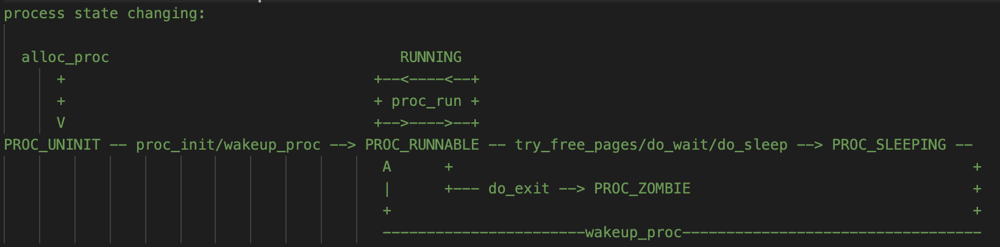

### <center>Lab5 实验报告</center>

<center>计71 韩荣 2016010189</center>

#### 练习1 加载应用程序并执行

##### 思路

​	本练习需要构造合理的trapframe，首先将trapframe的数据段和代码段都构造成user态的，并将其esp设置到用户栈的栈顶，然后将入口设置为elf文件中函数的入口位置，最后允许kernel态通过中断跳转到用户态，具体代码如下：

```c
    tf->tf_cs = USER_CS;		//设置代码段为用户态
    tf->tf_ds = tf->tf_es = tf->tf_ss = USER_DS;		//设置数据段为用户态
    tf->tf_esp = USTACKTOP;		//设置esp为用户态栈顶
    tf->tf_eip = elf->e_entry;	//设置程序入口
    tf->tf_eflags = FL_IF;   	//允许Interrupt到用户态
```

##### 请在实验报告中描述当创建一个用户态进程并加载了应用程序后，CPU 是如何让这个应用程序最终在用户态执行起来的。即这个用户态进程被 ucore 选择占用 CPU 执行（RUNNING 态）到具体执行应用程序第一条指令的整个经过。

​	操作系统通过schedul函数来对进程进行调度，在schedule函数中会调用proc_run函数，其功能在Lab4中已经分析了。它会将上下文、程序指针和栈指针都改变成另一个进程，这是在内核态进行的。

​	然后便是到了内核态中，此时需要运行forkret函数，

```mips
.globl __trapret
__trapret:
    # restore registers from stack
    popal

    # restore %ds, %es, %fs and %gs
    popl %gs
    popl %fs
    popl %es
    popl %ds

    # get rid of the trap number and error code
    addl $0x8, %esp
    iret
.globl forkrets
forkrets:
    # set stack to this new process's trapframe
    movl 4(%esp), %esp
    jmp __trapret
```

​		可以发现它最终调用了iret，此时iret会直接根据设置好的trapframe跳转到相应的用户应用程序，之所以能够跳转，是因为新进程创建之后，会调用SYS_exec，在这个里面调用load_icode对trapframe进行了设置。

​		调用了SYS_exec后，load_icode会将eip设置成elf->e_entry，因此在执行完毕之后再iret，就可以直接跳转到用户进程的第一行代码了。


#### 练习2 父进程复制自己的内存空间给子进程

##### 思路

​	本练习的目的是复制父进程的内存空间给子进程，需要用四部来完成，分别是：1、找到父进程的kernel_virtual_address；2、找到子进程的kernel_virtual_address；3、将一页的内容从父进程拷贝到子进程。4、为子进程的物理内存插入新的映射。用代码实现如下：

```c
 		void * src = page2kva(page);
    void * dst = page2kva(npage);
    memcpy(dst,src,PGSIZE);
    ret = page_insert(to,npage,start,perm);
```

##### 请在实验报告中简要说明如何设计实现”Copy on Write 机制“，给出概要设计，鼓励给出详细设计

​	要实现“Copy on Write”机制需要在每次fork拷贝mm_struct时，不拷贝，而是将指针指向原有的mm,还需设置为只读状态。这样读操作就可以正常进行了，如果要写，则会产生pagefault，而后则拷贝mm，然后进行修改即可。修改为只读不会影响vma_struct，因此，可以区分是COW的pagefault还是真实的pagefault。

#### 练习3  阅读分析源代码，理解进程执行 fork/exec/wait/exit 的实现，以及系统调用的实现

​	四个方法分别由四个函数实现，分别是do_fork(),do_execve(),do_wait(),do_exit()实现，下面分别介绍四个函数实现的过程（在此省去了函数的参数）。

##### 	do_fork():创建一个新的子进程并进行复制

​	首先需要调用proc_alloc()创建一个新的子进程，然后将它的parent设置为当前的进程，在此之后，定义它的kstack,mm,tf.context，之后再将它加入进程列表和哈希列表中，并为之分配pid，后将它的状态设置为RUNNABLE。

##### 	do_execve()：执行用户进程

​	首先需要将当前的进程清理成一个“壳”，即将删除当前指针对mm的索引，同时需要检查当前是否还有进程指向mm，如果没有，则重置mm。随后调用load_icode()根据二进制程序文件来对进程的信息进行设置：首先创建一个新的mm、然后创建一个新的PDT，mm的pgdir设置为PDT的kernel virtual adress、之后拷贝程序的数据段和代码段、建立用户栈、设置当前进程的mm、sr3、将cr3设置为物理地址的页目录、设置trapframe。

##### 	do_wait():等待子进程变成僵尸进程后，彻底释放子进程的资源

​	该函数可以通过输入一个特定的pid来制定wait哪一个进程，当找到一个僵尸进程之后，就可以跳转到found，执行相应的操作，否则，仍然跳转到repeat，来等待找到子进程，当然，在这个过程中，会调用schedule函数来进行其他进程的CPU分时间片占用。found中进行的操作是将进程从hashlist和proclist中都移除，然后将它的kernelstack给释放了，最后调用kfree将proc的内容完全释放。

##### 	do_exit():删除自己的mm、pagedirection等，并调用父进程彻底释放自己的资源

​	该函数首先删除proc的mm\pgdir\mmap，然后将自己的状态设置为僵尸进程，如果父进程正处于等待状态，则唤醒它，否则就调用initproc来回收该进程。最后，调用schedule函数来切换进程。

##### 	请分析 fork/exec/wait/exit 在实现中是如何影响进程的执行状态的？

​	上述四个函数是通过改变进程的state来改变进程的状态的。

##### 	请给出 ucore 中一个用户态进程的执行状态生命周期图（包执行状态，执行状态之间的变换关系，以及产生变换的事件或函数调用（字符方式画即可）

​	整理可得，一共有以下状态及相应修改状态的函数。

| PROC_UNINIT   | alloc_proc                        |
| ------------- | --------------------------------- |
| PROC_SLEEPING | try_free_pages, do_wait, do_sleep |
| PROC_RUNNABLE | proc_init, wakeup_proc            |
| PROC_ZOMBIE   | do_exit                           |

用户状态生命周期图（截图自proc.c）




#### 实现与参考答案的区别

​	由于本次实验逻辑完全按照注释，因此与练习答案大致相同。

#### 实验中重要的知识点

​	本次实验中重要的知识点：用户进程的创建和运行、用户进程空间的分配、进程的调度和状态机的设计、进程的生命周期。

​	未在本次试验中出现但仍然重要的知识点：用户线程的设计（即轻量级的进程）。


